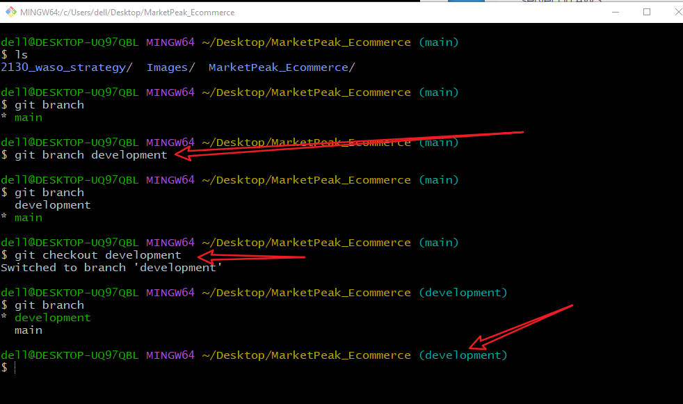

# Capstone Project- Introduction to Cloud Computing # 

### Tasks ###

**1. Implement Version Control with Git**

## 1.1. Initialize Git Repository ##

* Begin by creating a project directory named **"MarketPeak_Ecommerce"**

* Inside this directory, initialize a Git repository to manage your version control.

## 1.2. Obtain and Prepare the E-Commerce Website Template ## 

* Instead of developing the website from scratch, you'll use a preexisting e-commerce website template. This approach allows you to focus on the deployment and operational aspects, rather than on web development. The actual web development is done by web/software developers on the project.

* Extract the downloaded template into your project directory.

## 1.3. Stage and Commit the Template to Git. ##

* Add your website files to the Git repository

* Commit your changes with a clear, descriptive message.

## 1.4. Push the code to your Github repository. ##

After initializing your Git repository and adding your e-commerce website template, the next step is to push your code to a remote repository on GitHub. This step is crucial for version control and collaboration.

* Create a Remote Repository on GitHub: Log into your GitHub account and create a new repository named
"MarketPeak_Ecommerce" Leave the repository empty without initializing it with a README, gitignore, or license.

* Link Your Local Repository to GitHub: In your terminal, within your project directory, add the remote repository URL to your local repository configuration.

Click on the "New repository" 

Name it as any title of your choice and click on "Create repository"

Linking your new repository with your local trminal.

*Push your Code: Upload your local repository content to GitHub. Using this command `git push -u origin main`.

Oops! I've got an error when I tried to run the push command, as it's written, the error occured because I'm currently on *master branch* and not in *main branch* in my Github. 

Troubleshoot: This would make us create the *"main branch"* before pushing to the main on GitHub.

This is how your GitHub repository should look like.

**2. AWS Deployment.**
To deploy **"MarketPeak_Ecommerce"** platform, you'll start by setting up an Amazon EC2 instance:

## 2.1. Set Up an AWS EC2 Instance.

* Log in to the AWS Management Console.

After you've logged in, click on the "services" above and then select EC2. 

* Launch an EC2 instance using an Amazon Linux AMI.

Name your instance and select "Amazon Linux" as instructed.

Then click on "Launch" below.

* Connect to the instance using SSH.

## 2.2. Clone the repository on the Linux Server. ##

Before deploying your e-commerce platform, you need to clone the GitHub repository to your AWS EC2 instance. This process involves authenticating with GitHub and choosing between two primary methods of cloning a repository: SSH and HTTPS. To see the ssh or http link to clone your repository.

1. Navigate to your repository in github console.

2. Select the **code** as highlighted in the image below.

**Using SSH Method:**
* Generate SSH keypair using ssh-keygen.

 

* Display and copy your public key.
Using the command: `cat /home/ubuntu/.ssh/id_rsa.pub`

* Add the SSH public key to your GitHub account.

On your GitHub, click on your profile at the top right as shown above.

Then go ahead to click on settings.

You'd need to click on SSH and GPG keys.

Furthermore, by clicking on "New SSH key".

Give a title, then add SSH key.

A result of adding your public key to your github.

* Use the SSH clone URL to clone the repository:

Copy the repository from here.

Adn then clone with the command `git clone git@github.com:yourusername/MarketPeak_Ecommerce.git`

The HTTPS Method is ignored because It's not needed.

## 2.3. Install a Web Server on EC2 ##

[Apache HTTP Server (httpd)](https://www.google.com) is a widely used web server that serves HTML files and content over the internet. Installing it on Linux EC2 server allows you to host **MarketPeak E-commerce** site:

* Install Apache web server on the EC2 instance. Note that httpd is the software name for Apache on systems using yum package manager.
`sudo yum update -y
sudo yum install httpd -y
sudo systemctl start httpd
sudo systemctl enable httpd

This first updates the linux server and then installs httpd (Apache), starts the web server, and ensures it automatically starts on server boot.

Insatlling Apache

## 2.4. Configure httpd for Website ##
To serve the website from the EC2 instance, configure ***httpd*** to point to the directory on the Linux server where the website code files are stored. Usually in ***/var/www/html.***

* Prepare the Web Directory: Clear the default httpd web directory and copy MarketPeak Ecommerce website files to it.

Using: 
`sudo rm -rf /var/www/html/*
sudo cp -r ~/MarketPeak_Ecommerce/* /var/www/html/`

The directory ***/var/www/html/*** is a standard directory structure on Linux systems that host web content, particulatly for the ***Apache    http    Server.***

* Reload httpd: Apply the changes by reloading the httpd services.

Note: ***httpd*** is also known as ***Apache***

## 2.5. Access Website from Browser ##

* With ***httpd***  configured and website files in place, ***MarketPeak_Ecommerce*** platform is now live on the internet:

* Open a web browser and access the public IP of ypur EC2 instance to view the deployed website.

### 3. Continous Integration and Deployment Workflow. ###

To ensure a smooth workflow for developing, testing, and deploying your e-commerce platform, follow this structured approach. It covers naking changes in a development environment, utilizing version control with Git, and deploying updates to your production server on AWS.

**Step 1:** Developing New Features and Fixes.

Creation of a ***development branch*** and switching to it.

**Step 2:** Version Control with Git.

Stage the changes for a commit.

Commit your Changes.

Push all changes to origin.

**Step 3:** Pull Requests and Merging to the Main branch.

Checkout main and merge development.

**Step 4:** Deploying Updates to the Production Server.

Pull the latest changes on the server.

To update the configuration with the new changes.

Reload your Apache.

Testing New Chaanges.

    

